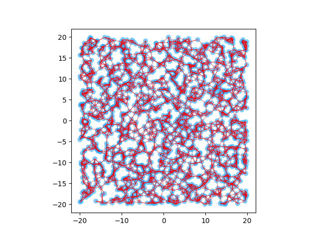
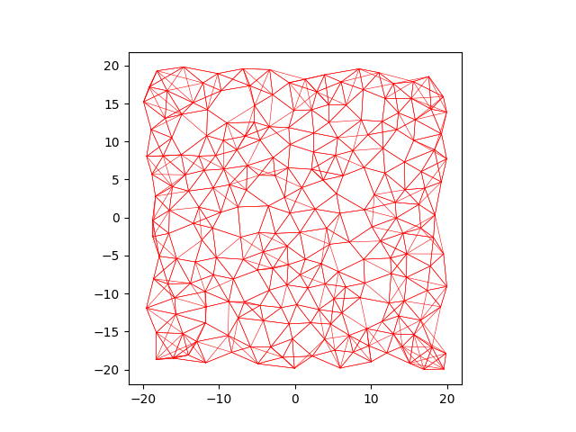

# Dynamic Graphical Memory Implementation

To instantiate a graph:

```python
graph = AsymMesh(n=10_000, k=6, dim=2, img_dim=[2], kernel_fn=l2, embed_fn=id2D, d_max=20)

graph.extend(xys, images=xys, meta=xys)
graph.update_zs()
graph.update_edges()
```

Most of the time it is better to enforce sparsity of the graph by only adding new vertices when there is no existing vertex that is close-by. The new dedupe API allows us to do this in a batch fashion:

```python
spots = graph.dedupe(images=xys, r_min=r_min)
xys = xys[spots]
ds = graph.to_goal(zs_2=xys)
if ds.size == 0:
    graph.extend(xys, images=xys, meta=xys)
else:
    m = ds.min(axis=-1) >= r_min
    if m.sum() > 0:
        graph.extend(xys[m], images=xys[m], meta=xys[m])
    graph.update_edges()
```

|                  Dense                   |            Sparse            |                           Details                            |
| :--------------------------------------: | :--------------------------: | :----------------------------------------------------------: |
|  |  | 10x more edges in the dense graph in comparison to the sparse graph. |

